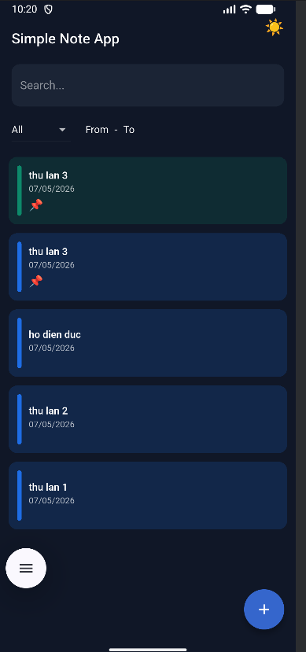
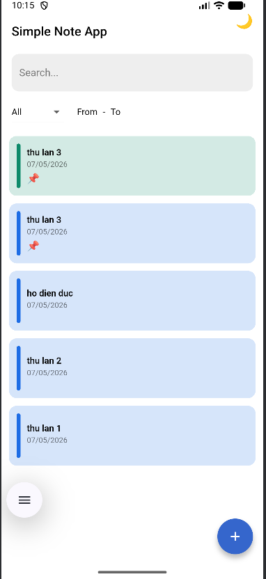
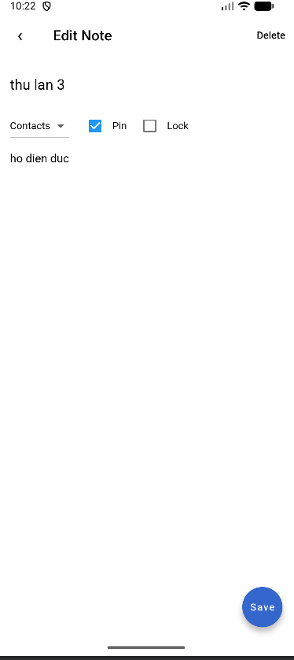
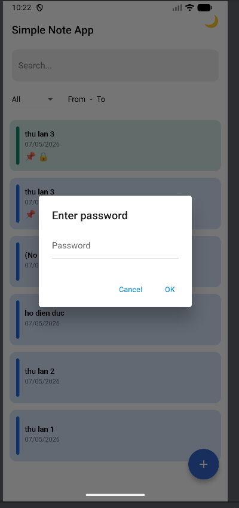
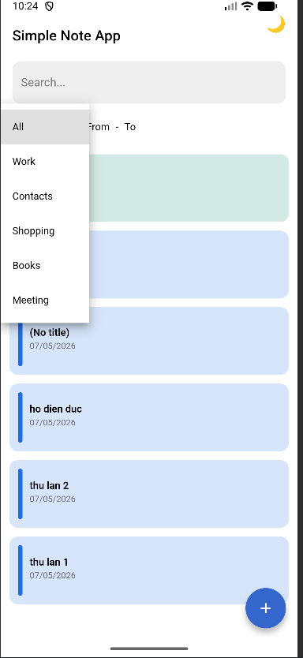
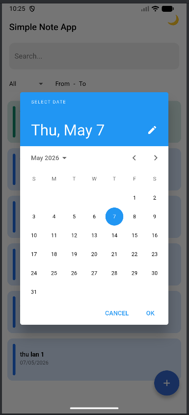

# 📘 Simple Note App – Flutter

A simple and modern note-taking app built with Flutter.  

The app is easy to use, fast, and supports dark mode, tags, password protection, and local storage.

---

## 📱 Screenshots

> Replace the links with your own uploaded images.

### Home Screen – Dark Mode


### Home Screen – Light Mode


### Note Editor


### Password Dialog


---

## ✨ Features

- Create, edit, and delete notes  
- Save notes locally using SQLite  
- Search notes by keyword  
- Filter notes by:
  - Tag
  - Date range  
- Pin important notes  
- Lock notes with a password  
- Create custom tags with custom colors  
- Light / Dark theme switch  
- Toast messages for:
  - Create success
  - Update success
  - Wrong password
  - Delete success  
- Simple and clean UI  

---

## 🛠 Technologies

| Tool | Purpose |
|------|---------|
| Flutter | Main framework |
| Provider | State management |
| SQLite (sqflite) | Local database |
| Intl | Date formatting |
| Material Design | UI styling |

---

## 📂 Project Structure

```
lib/
 │── main.dart
 │
 ├── models/
 │    └── note.dart
 │
 ├── database/
 │    └── db_helper.dart
 │
 ├── providers/
 │    ├── note_provider.dart
 │    └── theme_provider.dart
 │
 ├── screens/
 │    ├── home_page.dart
 │    └── note_editor_screen.dart
 │
 └── widgets/
      └── note_card.dart
```

---


---

## 📸 Screenshots


### Home Screen – Light Mode


### Note Editor


### Password Dialog


### Tag Picker  


### Date Picker  


---

## 💬 Feedback

If you want to improve this project:
- Create an issue  
- Open a pull request  
- Suggest new ideas  

This app is created for learning Flutter, Provider, SQLite, and UI design.

